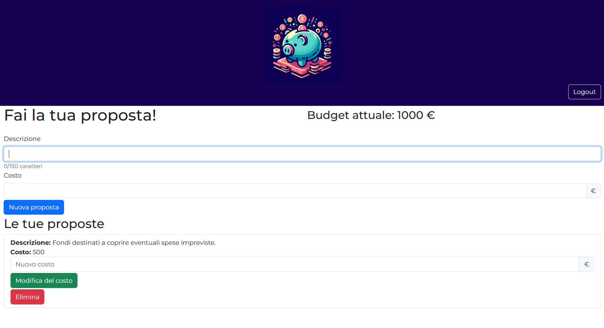
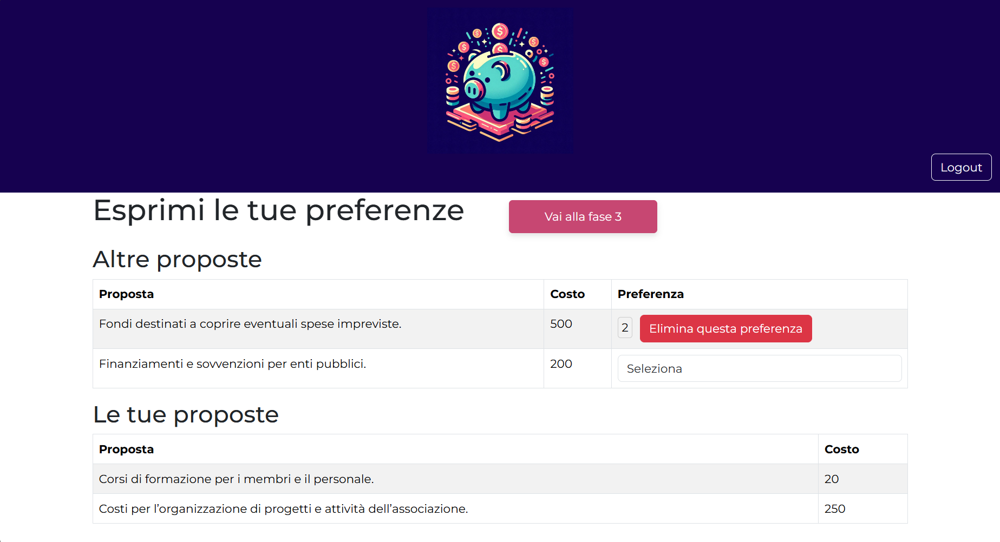

# Social Budget – Participatory Budgeting Platform

This is a full-stack web application developed as an individual project for the **Web Applications I** course at Politecnico di Torino (2024).  
It simulates a participatory budgeting process for a non-profit association, allowing members to propose and select initiatives to be funded with a shared budget, across four managed phases.

##  Purpose

The system supports the association in organizing and managing their yearly planning through a democratic and transparent voting process.  
It allows members to:

- Define a budget (admin only)
- Submit funding proposals
- Vote on proposals from other users
- Automatically compute approved proposals based on budget and total preferences

The application handles access control, role-based views, voting logic, and the transition between workflow phases.

---

##  Features Overview

The budgeting process is divided into four distinct phases:

### Phase 0 – Budget Definition  
Only accessible by the **administrator**, who sets the available budget for the year.

### Phase 1 – Proposal Submission  
Each logged-in **user** can create up to 3 proposals, specifying a description and a cost.  
Users can only view and modify their own proposals.

### Phase 2 – Proposal Voting  
All proposals are visible. Users can **assign preference scores (1 to 3)** to proposals from other users.  
Each user can only view and edit their own votes.

### Phase 3 – Results and Summary  
The system automatically approves proposals ranked by score, without exceeding the total budget.  
All users can see the final results; **only the admin** can restart the cycle.

Anonymous users can only see the outcome in Phase 3, and cannot participate.

---

## Screenshots

### Proposal Submission (Phase 1)
Users can create and manage their proposals:

### Proposal Voting (Phase 2)
Users vote on others' ideas with preference scores:

---

## Access Roles

- **Admin**: can configure the budget, switch phases, and reset the process
- **Registered members**: can submit proposals and vote
- **Anonymous users**: read-only access during Phase 3

The application ensures proper access to data and functionality based on user role and phase.

---

##  Project Notes

This project was developed individually as the final assignment for the course.  
The platform is built using **React** (frontend), **Node.js + Express** (backend), and **SQLite** (database).

For demo credentials or technical details, see project files.

---

## Author

Developed by the repository owner for academic purposes.  
For questions or further details, contact via GitHub.

